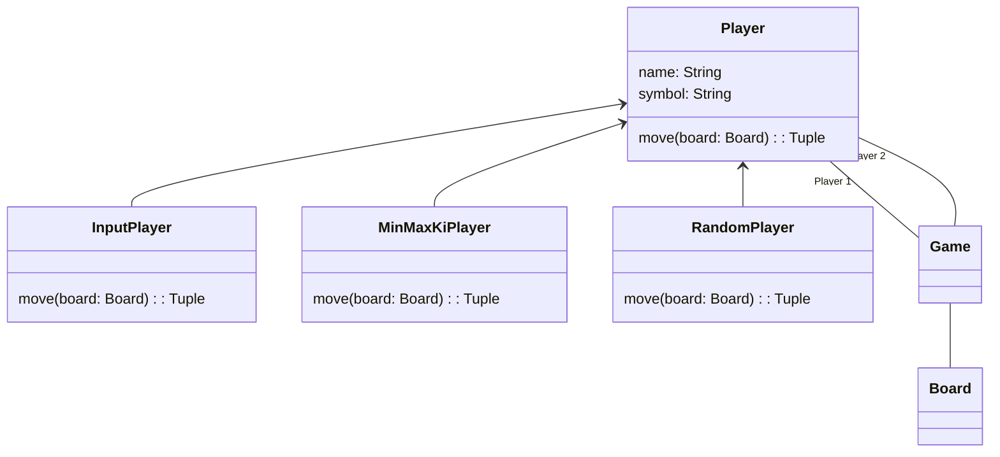

# Tic Tac Toe - Minimax

Implementation of Tic Tac Toe played by KI with minimax and alpha, beta pruning in Python.

## UML



## Getting Started

The game can be started with two players. A player must implement the method `move`. This methods returns the x,y coordinates for the board. In this example the class `MinMaxKiPlayer` is used for both players. `MinMaxKiPlayer` uses the minimax-algorithm to find the best move. You can also use `InputPlayer` for playing by terminal and `RandomPlayer` for returning a random move.

The game will be started with `run`. This method return the winning symbol or '0' if it`s a draw.

```python
    player1 = MinMaxKiPlayer("MinMaxKiPlayer 1", 1)
    player2 = MinMaxKiPlayer("MinMaxKiPlayer 2", 2, player1)
    player1.other_player = player2

    game = Game(player1, player2, x=3, y=3)
    winner = game.run()

    if winner == 0:
        print("It's a draw!")
    else:
        print(f"Player {winner} won the game!")
```
