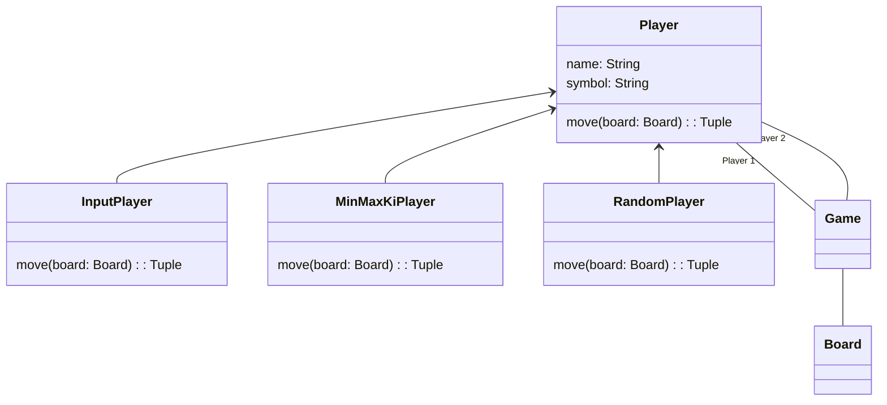

# Tic Tac Toe - Minimax

Implementation of Tic Tac Toe played by KI with minimax and alpha, beta pruning in Python

```mermaid
classDiagram

Player <-- InputPlayer
Player <-- MinMaxKiPlayer
Player <-- RandomPlayer

Game -- Board
Player "Player 1" -- Game
Player "Player 2" -- Game

class Board

class Game 

class Player {
    name: String
    symbol: String
    move(board: Board): Tuple<int, int>
}

class InputPlayer {
    move(board: Board): Tuple<int, int>
}

class MinMaxKiPlayer {
    move(board: Board): Tuple<int, int>
}

class RandomPlayer {
    move(board: Board): Tuple<int, int>
}
```